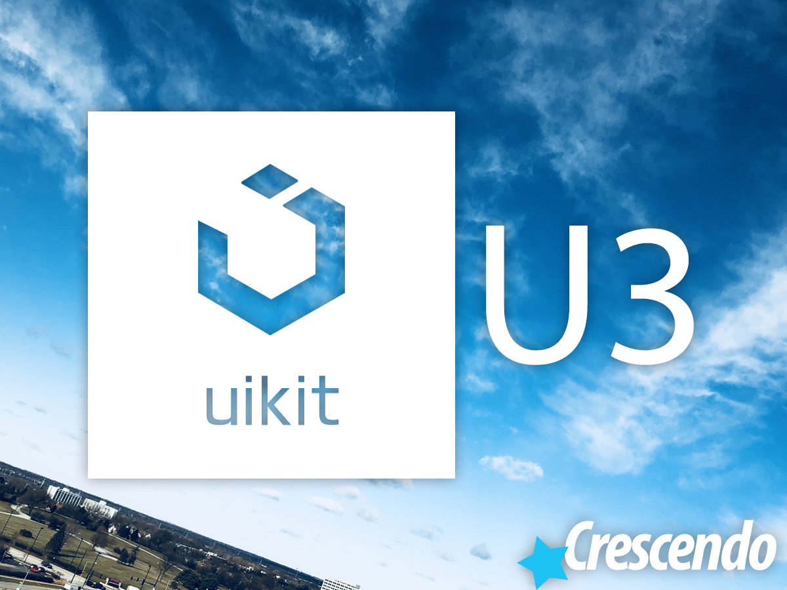

# U3 Starter Theme
U3 is an Wordpress Starter Theme based on the UIKit3+ framework by YooTheme. It aims to bring back a traditional template workflow and integrate some new features along the way. One can think of U3 Starter Theme as the never released yoo_master3, since YooTheme decided to butcher the system and make it pay-to-play.

 YooTheme had my heart and broke it. The developers are hard-headed about listening to any feedback, support is abysmal, it often takes weeks for simple bugfixes, and many months between new releases with questionable new features. The new YooTheme Pro was the final nail in the coffin. Not only does it destroy the workflow and make it nearly impossible for developers to actually build a site, it gets in your way and overcomplicates everything along the way. Oh, and there's no free yoo_master anymore, so you are forced to use UIKit2 on your beautiful modern themes or sacrifice the beauty that is UIKit 3... -Well, no more!

Introducting U3, named after the never released yoo_master3, a minimalistic template engine that brings all the UiKit3 goodness to Wordpress with a number of sleek modern enhancements including the Blade template engine from Laravel, shortcodes for your favorite components, CSS and JS compression and minification, and integration with standard Wordpress functions whenever possible.

While Yootheme probably dislikes this project, as UIkit itself is released under the MIT license, and no parts of the Yootheme Pro or even the yoo_master template are used in its creation, the U3 project should be kosher.

## What's New?
Changed around the file structure a bit and started normalizing things throughout.
* For everything that's new, check the [CHANGELOG.md](CHANGELOG.md) for the complete [Changelog](CHANGELOG.md#changelog) and [Roadmap](CHANGELOG.md#roadmap).

## Features
Some of these features may be planned or in-development at this time.
* A smart, nimble, flexible, and feature-packed template framework
* Smarty template engine for layouts
* DRY principles wherever possible
* CSS/SCSS/JS minification and caching
* Moves core functionality to plugins wherever possible
* Smartcodes for all your favorite UIKit3 elements
* Easily override default Wordpress templates or plugins

## Installation
See [INSTALLATION.md](INSTALLATION.md)

## Support
Please see [Frequently Asked Questions (FAQs)](INSTALLATION.md#faq) for common questions. If it isn't answered there, use Github to report any issues or contribute to the project yourself with bugfixes or new features. I am a newbie and learning as I go. I saw the need for this personally and am releasing it freely for anyone that can use it or wants to help the project and build upon it.

## Credits
See [LICENSE.md](LICENSE.md) for a full list of [Credits](LICENSE.md#credits) and [Licenses](LICENSE.md#licenses).
* [Christopher Martone - http://christophermartone.com](http://christophermartone.com)
* [Sage Template Starter - https://roots.io/sage](https://roots.io/sage/)
* [Laravel Blade - https://laravel.com/docs/master/blade](https://laravel.com/docs/master/blade)
* [UIKit - https://getuikit.com](https://getuikit.com/)
* [YooTheme - https://yootheme.com](https://yootheme.com/)
